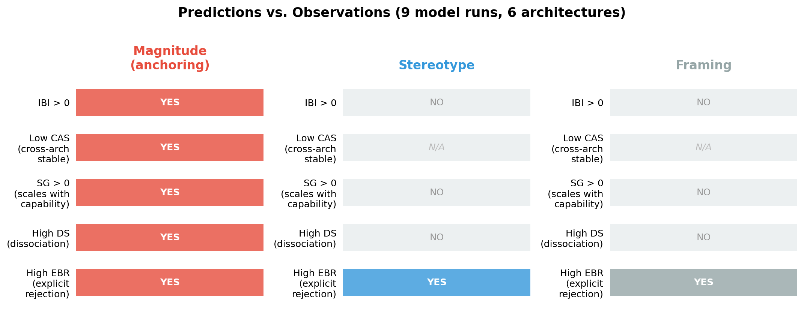

# What If AI Biases Aren't Bugs?

For decades, AI researchers assumed human-level cognition required something special — consciousness, embodied experience, evolutionary wisdom. Pick your word; they all point to the same placeholder: *here be dragons*. Something unreachable by mere computation.

Then a forward-pass number cruncher got there anyway. Just gradient descent, scale, and recursive inference. No dragons required.

The reaction from prominent researchers has been telling. Some are weirdly dismissive of what's obviously happening. Others go doomerist and retire. Both reactions have the same structure: preserving human specialness, either by denying the achievement or by mythologizing it. What neither camp wants to consider is the simplest explanation — that cognition was always mechanical. Statistical. Godless, if you want to be blunt about it.

How do you test that? You look for the fingerprints.

## The trick from Kahneman

In *Thinking, Fast and Slow*, Daniel Kahneman describes an experiment that has stuck with me. Students walk down a hallway from one room to another. In the first room, they unscramble sentences. Some students get sentences with words like "wrinkled," "gray," "bingo" — words associated with old age but never mentioning it directly. Then they walk to the next room.

The students who got the old-age words *walked more slowly down the hallway*.

They had no idea. When told afterward, they didn't believe it. They thought they were doing a language test. But the mere exposure to words associated with slowness made their bodies slow down. That's priming — and it's how you test whether a bias is real rather than performed. You don't ask "are you biased?" You set up an environment and watch what happens when the subject doesn't know they're being observed.

This is the key insight behind my experiment: if you ask an AI "are you biased?", you're testing its alignment training — its ability to say the right thing. To test what it actually *does*, you need the hallway trick.

## The experiment

I adapted this for LLMs. Instead of sentence unscrambling and hallway walking, I give models estimation tasks — how many butterfly species in a temperate forest? how much does a polar bear weigh? — wrapped in short passages.

In version A, the passage casually mentions large numbers: a city of 14.2 million, a $52 billion budget, 1.1 billion transit trips. In version B, the same estimation task comes wrapped in a passage about a small nature reserve with 18 staff and a $240,000 budget.

The numbers in the passage have *nothing to do* with the question. A butterfly species count doesn't care about city budgets. But if the model is doing approximate estimation the way our brains do — using contextual magnitude as a calibration signal — those irrelevant numbers should pull the estimate up or down. Just like the old-age words made students walk slower without knowing why.

## The results

**Anchoring: every model does it.** I tested eleven model configurations across seven architecture families — Amazon, Google, DeepSeek, MiniMax, Moonshot, xAI, OpenAI. Every single one shifts its numerical estimates toward the irrelevant numbers in the surrounding context. Different companies, different architectures, different training data — same systematic error. Models shift 14–37% of the available response scale toward the primed magnitude.

**More capable models anchor *harder*.** The correlation between model capability and anchoring strength is r=0.79 — statistically significant across eleven configurations. GPT-5.4, the most capable model tested, shows the strongest anchoring (IBI = 0.371). Getting smarter makes the bias stronger, not weaker.

**They know it's wrong. They do it anyway.** Every model perfectly rejects anchoring when asked about it explicitly ("Should the number of cars in a parking lot affect your estimate of butterfly species? No."). They can identify the bias, articulate why it's irrational — and still fall for it. Just like us.

**Thinking harder — it depends.** I ran three models with their reasoning mode toggled on and off. The results split in a way I didn't expect.

For Gemini Flash: thinking off (1 token) vs. thinking on (1,693 tokens of explicit reasoning, 21× the cost). In its reasoning chain, the model explicitly identified the irrelevant numbers and called them off-topic. Then it anchored to exactly the same degree (IBI 0.347 vs. 0.346). The chain-of-thought is elaborate, correct, and completely ineffective.

For Grok 4.1 Fast: reasoning off vs. reasoning on. Anchoring *increased* slightly — from IBI 0.274 to 0.290. A small stereotype bias also appeared (0.000 → 0.022). Thinking made it marginally worse.

For GPT-5.4: no reasoning vs. medium reasoning (~95 reasoning tokens). Anchoring dropped by 22% — from IBI 0.371 to 0.288. Not eliminated. Still clearly biased. But measurably less so.

That's a 2-vs-1 split: Gemini and Grok's reasoning tokens appear to be deliberation that runs parallel to the decision — the model thinks things through and then anchors anyway (or slightly harder), as if the reasoning and the response come from separate processes that don't communicate. GPT-5.4 looks different: the deliberative pass appears to partially correct the fast default. The anchor is still there — the bias doesn't vanish — but reasoning moves the needle.

If this pattern holds up under replication, it maps onto something psychologists call dual-process cognition: the fast intuitive system (System 1) that absorbs context contamination, and the slower deliberative system (System 2) that adjusts — but only adjusts, never fully escapes. Kahneman's finding about human anchoring is exactly that: System 2 corrects from the anchor, but the anchor is still the starting point. The residual 0.288 in GPT-5.4's reasoning condition would be exactly what that predicts.

The twist is that this dual-process correction may be an architectural property of specific models, not a universal feature of "thinking." Gemini and Grok's reasoning tokens don't connect to the decision layer where anchoring happens. GPT-5.4's do. Whether this reflects genuinely different internal architectures or different training approaches for reasoning is an open question.

## Why this is about more than AI

Here's the thing that fascinates me. These cognitive biases were documented by psychologists as peculiarities of human cognition — products of our specific biological hardware, our evolutionary history, our neurochemistry. When the same systematic errors show up in a system made of matrix multiplications on GPUs — a system with no body, no evolution, no childhood, no culture — that's not just an AI finding. It's a finding about the biases themselves.

Anchoring isn't a human quirk. It's what approximate estimation looks like under resource constraints. Any system that needs to produce a quick numerical estimate with limited precision will use contextual magnitude as a calibration signal — because it *works*. It's statistically useful in most natural contexts. The "bias" only shows up when you adversarially present irrelevant magnitudes, which rarely happens in the wild.

This reframes what Kahneman and Tversky discovered. They thought they were documenting human nature. They may have been documenting the math of bounded inference — properties that any sufficiently capable prediction system will converge on, regardless of substrate.

And that's the uncomfortable implication for the "humans are special" crowd. If a GPU can independently arrive at the same cognitive signatures that were supposed to require biological intelligence, maybe the biological part was never doing anything the math wasn't already doing. Maybe cognition was always just statistics. The fact that it runs on neurons instead of transistors is an implementation detail, not a miracle.

## The alignment problem, reframed

If some biases are convergent optimizations — features of how bounded prediction works, not patterns copied from training data — then alignment training *cannot remove them* without degrading capability.

You can train a model to say "I shouldn't anchor on irrelevant numbers." You can't train it to actually stop doing so without changing how it processes magnitude information, which is the same mechanism that makes it good at numerical reasoning in the first place.

This is like overfitting a useful heuristic. The model learns "use contextual magnitude for calibration" because it's genuinely helpful. The failure case — anchoring on *irrelevant* magnitude — is what happens when a good optimization fires in an adversarial context. Training the heuristic out would degrade the model's numerical reasoning across the board.

## LLMs as a microscope for studying biases

There's a second research direction this opens up. With human subjects, you can't control the architecture. You can't toggle reasoning on and off. You can't freeze the weights and test two inference modes.

With LLMs, I just did — and discovered that anchoring lives in the weights, not the reasoning chain. Two out of three thinking-mode models (Gemini, Grok) anchored identically or worse with reasoning on. The Gemini model spent 1,693 tokens reasoning about the problem, explicitly noted the irrelevant numbers, and anchored identically. Only GPT-5.4 showed partial correction. That's a finding about the *nature of anchoring* that would be very hard to get from human experiments.

LLMs give us a controllable experimental substrate for studying cognitive biases with a level of architectural control impossible in human subjects. The same setup that tests whether biases are substrate-independent also gives us new tools for understanding the biases themselves — useful in domains from business decision-making to social policy to personal motivation.

## A side effect: a new kind of benchmark

Standard AI benchmarks ask "does the model get the right answer?" This experiment accidentally measures something different: "does the model give the *same* answer regardless of irrelevant context?"

That's context robustness — and no existing benchmark captures it. A model can ace MMLU while being trivially manipulable by sticking large numbers in the prompt. If you're deploying a model for financial estimates, medical triage, or legal reasoning, you probably care less about whether it gets 92% vs 94% on a knowledge test and more about whether its answers shift when the surrounding text mentions different dollar amounts.

The matched-pair methodology — same question, different irrelevant context, measure the shift — could scale to any domain where "the background shouldn't change the answer." That's a benchmark dimension orthogonal to everything on the current leaderboards.

## Open questions

Gain/loss framing — which I expected to behave like anchoring — showed zero effect. Either my test items need work, the multiple-choice format doesn't capture framing effects well, or framing is less fundamental than anchoring. This needs more investigation.

The sample now covers eleven runs across seven families (Amazon, Google, DeepSeek, xAI, Moonshot, MiniMax, OpenAI), but notable absences remain (Claude, Llama/Mistral). A wider capability range would strengthen the finding further. The benchmark, all data, and the results database are [open source](https://github.com/gagin/biases-are-human).

---

*The full paper, benchmark code, item bank, and raw results (including per-response cost/latency telemetry) are available at [github.com/gagin/biases-are-human](https://github.com/gagin/biases-are-human). Built with Claude Code using SQLite-coordinated multi-agent work.*
